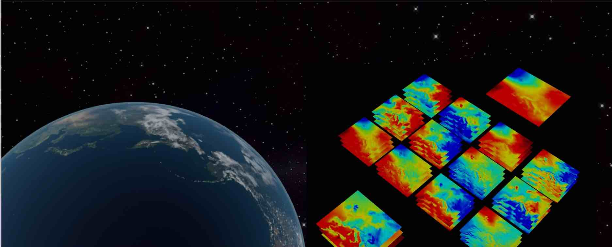

[Check our video](https://www.youtube.com/watch?v=Tf2BDDlSDeQ)


## Table of Contents  

- [Introduction to Atmopsheric Machine learning Benchmarking System](#introduction-to-atmopsheric-machine-learning-benchmarking-system)
- [Prerequisites](#prerequisites)
- [Installation](#installation)
- [Start with AMBS](#start-with-ambs)
  * [Set-up environment and target directory on Jülich's HPC systems or other computing systems](#set-up-environment-and-target-directory-on-j-lich-s-hpc-systems-or-other-computing-systems)
  * [Prepare your dataset](#prepare-your-dataset)
    + [Dry run with small samples (~15 GB)](#dry-run-with-small-samples---15-gb-)
    + [Access ERA5 dataset (~TB)](#access-era5-dataset---tb-)
    + [climatological mean data](#climatological-mean-data)
  * [Run the workflow](#run-the-workflow)
  * [Preparation with NVIDIA's TF1.15 singularity containers](#preparation-with-nvidia-s-tf115-singularity-containers)
  * [Create specific runscripts](#create-specific-runscripts)
  * [Running the workflow substeps](#running-the-workflow-substeps)
  * [Input and Output folder structure and naming convention](#input-and-output-folder-structure-and-naming-convention)
  * [Benchmarking architectures:](#benchmarking-architectures-)
  * [Contributors and contact](#contributors-and-contact)
  * [On-going work](#on-going-work)


## Introduction to Atmopsheric Machine learning Benchmarking System 

**A**tmopsheric **M**achine learning **B**enchmarking **S**ystem (AMBS) aims to provide state-of-the-art video prediction methods applied to the meteorological domain. In the scope of the current application, the hourly evolution of the 2m temperature over a used-defined region is focused. 

Different Deep Learning video prediction architectures such as convLSTM and SAVP are trained with ERA5 reanalysis to perform a prediction for 12 hours based on the previous 12 hours. In addition to the 2m temperature (t2m) itself, other variables can be fed to the video frame prediction models to enhance their capability to learn the complex physical processes driving the diurnal cycle of temperature. Currently, the recommended additional meteorological variables are the 850 hPa temperature (t850) and the total cloud cover (tcc) as described in our preprint GMD paper. 

## Prerequisites
- Linux or macOS
- Python 3
- CPU or NVIDIA GPU + CUDA CuDNN
- MPI
- Tensorflow 1.13.1 or CUDA-enabled NVIDIA TensorFlow 1.15 within a singularity container 
- CDO >= 1.9.5

## Installation 

Clone this repo by typing the following command in your personal target dirctory:

```bash 
git clone https://gitlab.jsc.fz-juelich.de/esde/machine-learning/ambs.git
```

Since the project is continuously developed and make the experiments described in the GMD paper reproducible, we also provide a frozen version:

```bash 
git clone https://gitlab.jsc.fz-juelich.de/esde/machine-learning/ambs_gmd1.git
```

This will create a directory called `ambs` under which this README-file and two subdirectories are placed. The subdirectory `[...]/ambs/test/` contains unittest-scripts for the workflow and is therefore of minor relevance for non-developers. The subdirectory `[...]/ambs/video_prediction_tools` contains everything which is needed in the workflow and is, therefore, called the top-level directory in the following.

Thus, change into this subdirectory after cloning:
```bash 
cd ambs/video_preditcion_tools/
```


## Start with AMBS

### Set-up environment and target directory on Jülich's HPC systems or other computing systems

The following commands will setup a customized virtual environment
either on a known HPC-system at JSC (Juwels, Juwels Booster or HDF-ML). Setting up a virtual environment on other computing systems, e.g. the personal computer, is currently not supported, but targeted for the future. The script `create_env.sh` automatically detects on which machine it is executed and loads/installs all required Python (binary) modules and packages. The virtual environment with the name provide by user is then set up in a subdirectory `[...]/ambs/video_prediction_tools/virtual_envs/<env_name>` the top-level directory (`[...]/ambs/video_prediction_tools`).

```bash
cd env_setup
source create_env.sh <env_name> 
```

This also already sets up the runscript templates with regards to the five steps of the workflow for you under the folder  `[...]/ambs/video_prediction_tools/HPC_scripts`. 

By default, the runscript templates make use of the standard target base directory `/p/project/deepacf/deeprain/video_prediction_shared_folder/`. This directory will serve as your standard top-level direcotry to store the output of each step in the workflow (see details in #Input-and-output-folder-tructure-and-naming-convention). In case that you want to deviate from this, you may call create_env.sh` as follows:

```bash
source create_env.sh <env_name> -base_dir=<my_target_dir>
```
**Note** that suifficient read-write permissions and a reasonable amount of memory space is mandatory for your alternative standard output directory.


### Prepare your dataset

#### Dry run with small samples (~15 GB)
In weatheer and Ccimate application, we are also dealing with the large dataset. However, we prepare rather small samples (3 months data with few variables) to help the users test the workflow.
- For the users of JSC HPC system: The data can be downloaded through the following link  [LINK!!] . 
- For the users of deepacf project: You can also access `cd /p/project/deepacf/deeprain/video_prediction_shared_folder/GMD_samples` 

#### Access ERA5 dataset (~TB)
The experiment described in the GMD paper relies on the rather large ERA5 dataset with 13 years data.  

- For the users of JSC HPC system: You access the data from the followin path: /p/fastdata/slmet/slmet111/met_data/ecmwf/era5/grib. If you meet access permission issue please contact: Stein, Olaf <o.stein@fz-juelich.de>
-  For the users of deepacf project: You can retrieve the ERA5 data from the ECMWF MARS archive by specifying a resolution of 0.3° in the retrieval script (keyword "GRID",  https://confluence.ecmwf.int/pages/viewpage.action?pageId=123799065 ).

#### climatological mean data
climatological mean which is inferred at each grid point from the ERA5 reanalysis data between 1990 and 2019 is used in the postprocess step. The data can be download  [LINK!!]  

### Preparation with NVIDIA's TF1.15 singularity containers

Since 2022, JSC HPC does not support TF1.X in the current stack software system. As an intermediate solution before the TF2 version being ready,
a singularity container with a CUDA-enabled NVIDIA TensorFlow v1.15 was made available which has to be reflected when setting up the virtual environment and when submiiting the job.  

Firstly, if you are the user of JSC HPC system, you need to log in [Judoor account] (https://judoor.fz-juelich.de/login) and specifically ask for the request to access to the restricted container software. 

 Then, you can either download container image ([Link](https://docs.nvidia.com/deeplearning/frameworks/tensorflow-release-notes/rel_21-09.html#rel_21-09)) and place it under the folder`HPC_script`;  Or you can access to the image though the symlink command as below, if you are part of the *deepacf*project (still link to the `HPC_scripts`-directory)

` ln -sf /p/project/deepacf/deeprain/video_prediction_shared_folder/containers_juwels_booster/nvidia_tensorflow_21.09-tf1-py3.sif` 

### Run the workflow

Depending on the computing system you are working on, the workflow steps will be invoked by dedicated runscripts either from the directory `HPC_scripts/` (on known HPC-systems, see above) or from the directory `nonHPC_scripts/` (else, but not implemented yet).

To help the users conduct different experiments with different configuration (e.g. input variables, hyperparameters etc).  Each runscript can be set up conveniently with the help of the Python-script `generate_runscript.py`. Its usage as well the workflow runscripts are described subsequently. 


### Create specific runscripts

Specific runscripts for each workfow substep (see below) are generated conventiently by keyboard interaction.

The interactive Python-script thereby has to be executed in an activated virtual environment with some addiional modules! After prompting 

```bash
python generate_runscript.py
```

You will be asked first which workflow runscript shall be generated. You can chose one of the workflow step name: 
- extract
- preprocess1
- preprocess2
- train
- postprocess 

The subsequent keyboard interactions then allow  the user to make individual settings to the workflow step at hand. By pressing simply Enter, the user may receive some guidance for the keyboard interaction. 

Note that the runscript creation of later workflow substeps depends on the preceding steps (i.e. by checking the arguments from keyboard interaction).
Thus, they should be created sequentially instead of all at once at the beginning. 

### Running the workflow substeps 

Having created the runscript by keyboard interaction, the workflow substeps can be run sequentially. Depending on the machine you are working on, change either to `HPC_scripts/` (on Juwels, Juwels Booster or HDF-ML) or to 
`nonHPC347_scripts/` (not implemented yet).
There, the respective runscripts for all steps of the workflow are located 
whose order is as follows. Note that `[sbatch]` only has to precede on one of the HPC systems. Besides data extraction and preprocessing step 1 are onyl mandatory when ERA5 data is subject to the application.

Note we provide default configurations for each runscripts 
that the users still need to manully configure flags based on which project and HPC systems you are currently working on. Particurly, you must replace the flag `#SBATCH --account =<your computing project name>` with your project name. For partitions `#SBATCH --partition=`, we refer the users to the following link [JUWELS/JUWELS Booster](https://apps.fz-juelich.de/jsc/hps/juwels/batchsystem.html#slurm-partitions) for further information. If you are using HDF-MLsystem, you can simply use `batch` as partition.

Now it is time to run the AMBS workflow
1. Data Extraction: This script retrieves the demanded variables for user-defined years from complete ERA% reanalysis grib-files and stors the data into netCDF-files.

```bash
[sbatch] ./data_extraction_era5.sh
```

2. Data Preprocessing: Crop the ERA 5-data (multiple years possible) to the region of interest (preprocesing step 1),
The TFrecord-files which are fed to the trained model (next workflow step) are created afterwards. Thus, two cases exist at this stage:

    * **ERA 5 data**
    ```bash
    [sbatch] ./preprocess_data_era5_step1.sh
    [sbatch] ./preprocess_data_era5_step2.sh
    ```

3. Training: Training of one of the available models with the preprocessed data. <br>
Note that the `exp_id` is generated automatically when running `generate_runscript.py`.
    * **ERA 5 data**
    ```bash
    [sbatch] ./train_model_era5_<exp_id>.sh
    ```
    
4. Postprocess: Create some plots and calculate the evaluation metrics for test dataset. <br>
Note that the `exp_id` is generated automatically when running `generate_runscript.py`.

    * **ERA 5 data**
    ```bash
    [sbatch] ./visualize_postprocess_era5_<exp_id>.sh
    ```

### Input and Output folder structure and naming convention
The details can be found [name_convention](docs/structure_name_convention.md)

```
├── ExtractedData
│   ├── [Year]
│   │   ├── [Month]
│   │   │   ├── **/*.netCDF
├── PreprocessedData
│   ├── [Data_name_convention]
│   │   ├── pickle
│   │   │   ├── train
│   │   │   ├── val
│   │   │   ├── test
│   │   ├── tfrecords
│   │   │   ├── train
│   │   │   ├── val
│   │   │   ├── test
├── Models
│   ├── [Data_name_convention]
│   │   ├── [model_name]
│   │   ├── [model_name]
├── Results
│   ├── [Data_name_convention]
│   │   ├── [training_mode]
│   │   │   ├── [source_data_name_convention]
│   │   │   │   ├── [model_name]

```

### Benchmarking architectures:

- convLSTM: [paper](https://papers.nips.cc/paper/5955-convolutional-lstm-network-a-machine-learning-approach-for-precipitation-nowcasting.pdf),[code](https://github.com/loliverhennigh/Convolutional-LSTM-in-Tensorflow)
- Stochastic Adversarial Video Prediction (SAVP): [paper](https://arxiv.org/pdf/1804.01523.pdf),[code](https://github.com/alexlee-gk/video_prediction) 
- Variational Autoencoder:[paper](https://arxiv.org/pdf/1312.6114.pdf)


### Contributors and contact

The project is currently developed by Bing Gong, Michael Langguth, Amirpasha Mozafarri, and Yan Ji. 

- Bing Gong: b.gong@fz-juelich.de
- Michael Langguth: m.langguth@fz-juelich.de
- Amirpash Mozafarri: a.mozafarri@fz-juelich.de
- Yan Ji: y.ji@fz-juelich.de

Former code developers are Scarlet Stadtler and Severin Hussmann.

### On-going work

- Port to PyTorch version
- Parallel training neural network
- Integrate precipitation data and new architecture used in our submitted CVPR paper
- Integrate the ML benchmark datasets such as Moving MNIST 


